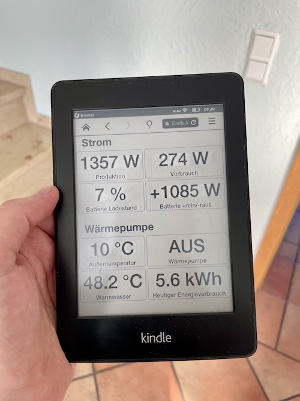

# Kindle Energy Dashboard

I searched for a cheap way to have an always on dashboard showing some energy metrics of our houshold.

This project is the result of it. The idea is to use an E-Book reader like the shown Amazon Kindle Whitewhite for this, because it basically only needs power when the displayed content is changing.

## Technical Requirements
- E-Book reader with a browser
- a server (RPi or something)
- access to metrics via API
  
## How it works
- the server updates a website every minute
  - [kindle.lab.internal/index.html.template](index.html.template) contains the basic layout of the website with placeholders
  - [kindle.lab.internal/update.sh](update.sh) is fetching metrics from a server via APIs and replaces the placeholders
  - create a cronjob for executing the `update.sh` every minute like this
    - `$ crontab -e`
    - `* * * * * /home/stefan/docker/kindle.lab.internal/update.sh`
- the server has a webserver installed like Caddy which serves the file
  - HTTPS can be an issue for old E-Book readers because of missing support for new encryption technology
  - See [caddy/Caddyfile](Caddyfile) and setup using [docker compose](docker-compose.yml)
- the E-Book reader displays the website in its brower
  - the site refreshes itself automatically every minute